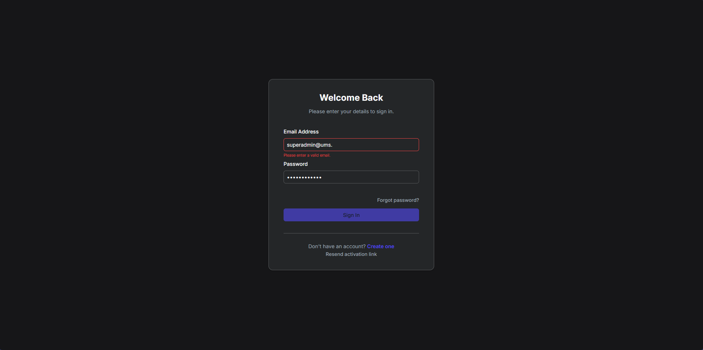
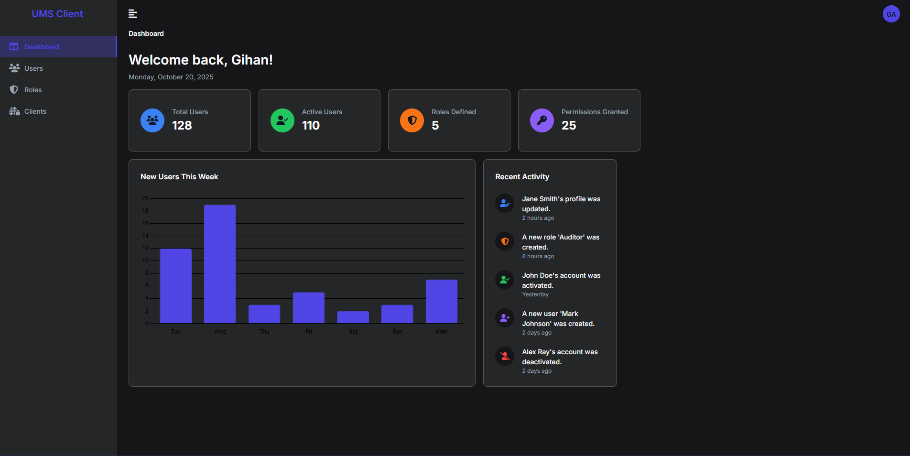
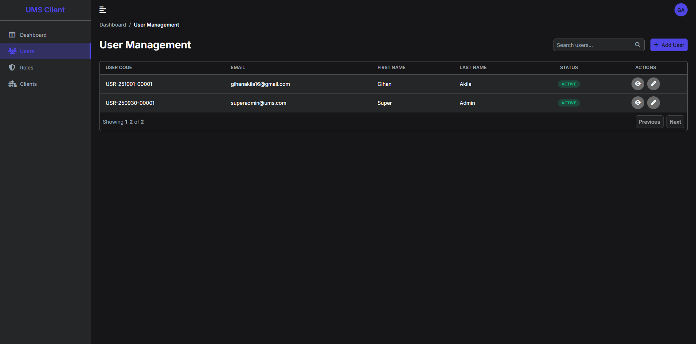
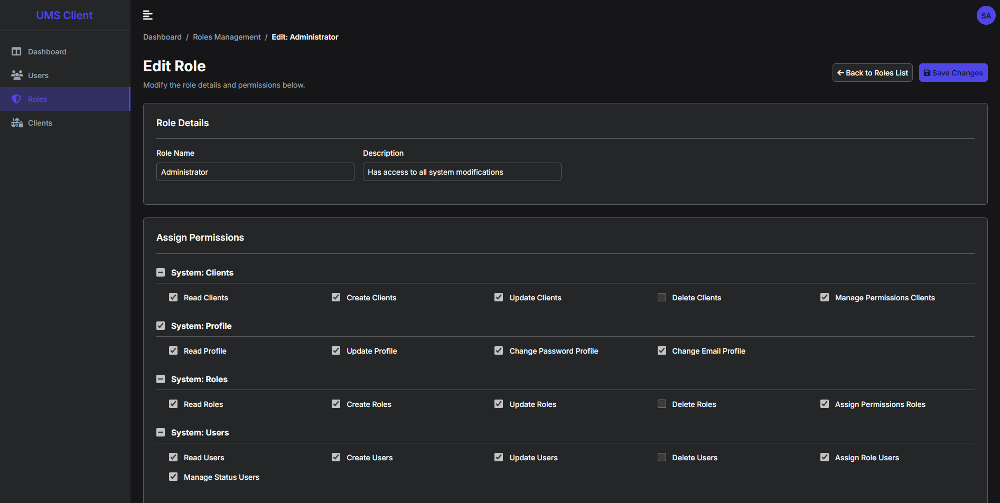
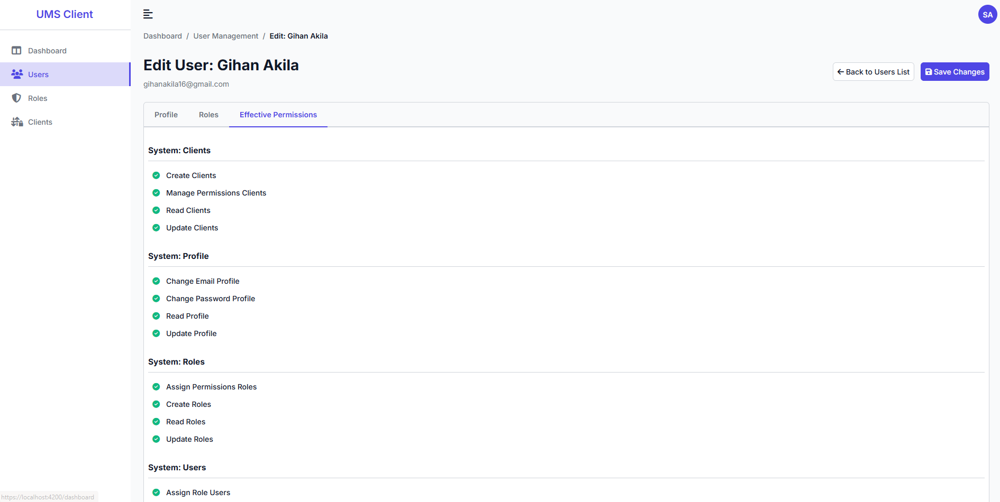
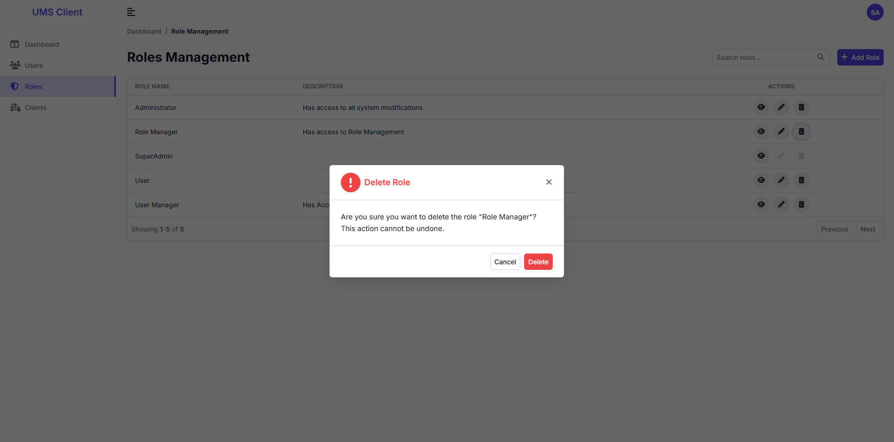

# User Management System (UMS)

A modern, full-stack User Management System built from the ground up to showcase best practices in both frontend and backend development. The frontend is a feature-rich Angular SPA, and the backend is a secure .NET Web API.

**Live Demo:** [[Deployed application](https://ums-client-200915304888.asia-south1.run.app/)]

---

## ✨ Key Features

- **Full Authentication Flow:** Secure user registration, login, and password reset functionality using JWTs and HttpOnly refresh tokens.
- **Role-Based Access Control (RBAC):**
    - **Route-level security** using `CanActivateFn` guards to protect pages.
    - **UI-element security** with a custom `*appHasPermission` directive to declaratively show/hide buttons and menu items.
- **Complete CRUD Operations:** Fully-featured management pages for both Users and Roles.
- **Custom Component Library:** A complete set of reusable components built from scratch without any external libraries (like Angular Material or PrimeNG).
    - Generic Data Table with sorting and pagination.
    - Dynamic Modal & Dialog system.
    - Advanced `PermissionTree` custom form control.
    - Animated Dropdown menus.
- **Advanced State Management:** Utilizes NgRx for predictable global state, with lazy-loaded feature states for performance.
- **Responsive Design:** A clean, modern UI that works on any device, complete with a professional light/dark theme.
- **Interactive Dashboard:** A dynamic dashboard featuring charts (using Chart.js) and key metric cards.

---

## 📸 Screenshots

| Login Page | Dashboard |
| :---: | :---: |
|  |  |
| **User Management** | **Role Editor** |
|  |  |
| **Light mode** | **Confirmation Dialog** |
|  |  |

---

## 🛠️ Technology Stack

### Frontend
- **Angular 19** (Standalone Components)
- **TypeScript**
- **NgRx** for state management
- **RxJS** for asynchronous operations
- **Sass (SCSS)** for styling
- **Chart.js** for data visualization

### Backend
- **.NET 8** Web API
- **C#**
- **Entity Framework Core** for data access
- **PostgreSQL** Database
- **JWT** for Authentication

### DevOps
- **Docker** for containerization
- **GitHub Actions** for CI/CD
- **Google Cloud Run** for hosting

---

## 🚀 Architectural Highlights

This project was built to demonstrate a deep understanding of modern web architecture. Key patterns include:

1.  **Hybrid State Management:** Uses NgRx for shared, global state (like auth) while leveraging component-level services for localized, complex state (like the multi-tab user edit form). This shows a pragmatic approach to state management.

2.  **Dynamic Component Injection:** The `DialogService` uses Angular's `ViewContainerRef` to dynamically create and destroy modal components at runtime, creating a powerful, decoupled UI system.

3.  **Declarative, Multi-Layered Security:** Combines route guards and a custom structural directive (`*appHasPermission`) to enforce authorization at both the page and element level.

4.  **Custom Form Controls with `ControlValueAccessor`:** Advanced components like the `PermissionTreeComponent` implement this interface, allowing them to integrate seamlessly with Angular's Reactive Forms.

---

## 🏁 Getting Started

### Prerequisites
- [.NET 8 SDK](https://dotnet.microsoft.com/download)
- [Node.js and npm](https://nodejs.org/)
- [PostgreSQL](https://www.postgresql.org/download/)

### Backend Setup
```bash
# 1. Navigate to the backend project directory
cd /path/to/your/backend

# 2. Restore dependencies
dotnet restore

# 3. Update the database connection string in appsettings.Development.json

# 4. Apply database migrations
dotnet ef database update

# 5. Run the application
dotnet run